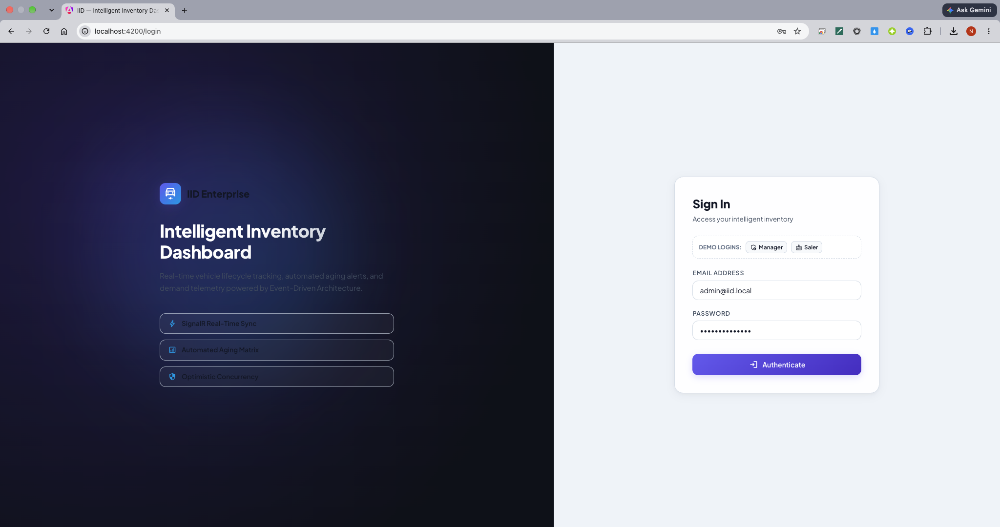
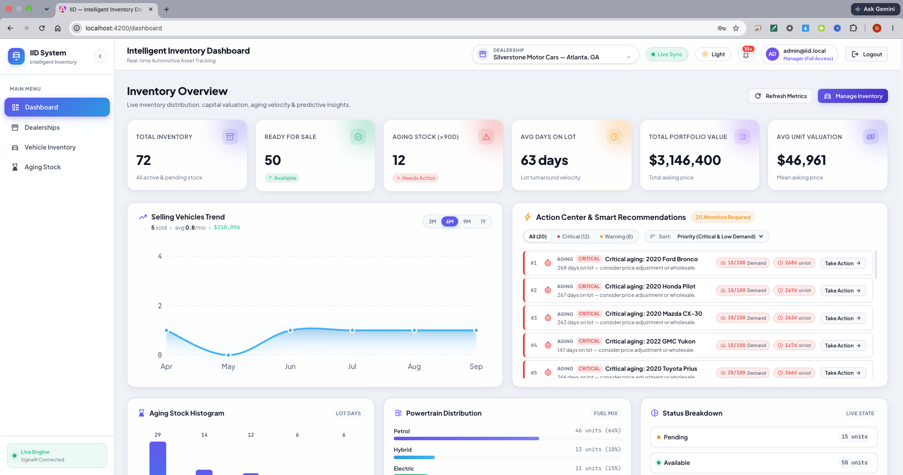
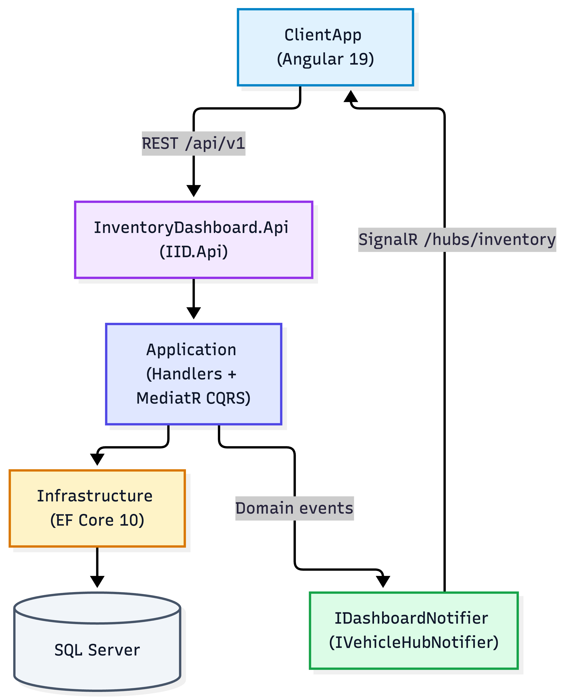

# Intelligent Inventory Dashboard

> [!NOTE]
> **Brief Overview Only:** This document provides a high-level operational overview and quickstart guide. It is **not** the complete system design specification. For comprehensive architectural blueprints, trade-off analyses, data modeling, automated test pyramid architecture, and empirical load testing benchmarks, please refer to [`docs/SYSTEM_DESIGN.md`](./docs/SYSTEM_DESIGN.md).

The **Intelligent Inventory Dashboard (IID)** is an enterprise vehicle inventory monitoring and capital-preservation platform designed for automotive dealership general managers, pricing directors, and inventory controllers. It transforms passive lot management into an active, data-driven operational workflow by surfacing critical aging stock (>90 days), calculating real-time portfolio valuations, tracking sales velocity, and enabling auditable remediation actions.





### Key Capabilities

- **Total Working Capital Visibility:** Real-time asset valuation of the dealership's vehicle base (e.g., $3,146,400 across 72 units at Silverstone Motor Cars, with an average unit valuation of $46,961).
- **Turnaround Velocity & Aging Tracking:** Instant lot tenure analysis measuring average lot velocity (63 days) against inventory turnover benchmarks, proactively flagging critical aging stock (>90 days) incurring holding costs ($25–$40/day).
- **Action Center & Smart Prioritization:** Surfaces high-risk units paired with low demand scores alongside monthly sales trends, powertrain mix distributions (Petrol, Hybrid, Electric), and live inventory status breakdowns.
- **Auditable Remediation Workflows:** Closed-loop operational action logging (*Price Reduction Planned*, *Wholesale Transfer*, *Ad Campaign Boost*, *General Manager Review*) with quick-note presets and real-time multi-user WebSocket synchronization.
- **Enterprise Multi-Branch Support:** Real-time visibility and inventory transfer operations across 10 metropolitan dealership branches.

---

## Architecture

Clean Architecture with CQRS (MediatR), FastEndpoints (REPR), in-process domain events, EF Core 10, SQL Server 2022, SignalR, and OpenTelemetry observability.



**Design decisions**

- **Modular Monolith & Clean Architecture:** Dependencies point strictly inward. Domain aggregates contain pure business logic with zero framework or external dependencies.
- **FastEndpoints REPR Pattern:** Vertical-slice Request-Endpoint-Response presentation architecture replaces legacy MVC controllers, delivering sub-20ms execution and automated OpenAPI v3 contracts.
- **CQRS via MediatR:** Strict separation of read and write workloads with pipeline behaviors (`ValidationBehavior` for FluentValidation, `PerformanceBehavior` for latency tracking).
- **In-Process Domain Events:** State mutations stage domain events; `DomainEventDispatchInterceptor` publishes them via MediatR only after successful database transaction commits (no message brokers or outbox required).
- **Single-Roundtrip Aggregate Dashboard:** `GET /api/v1/dashboard?dealershipId={id}&page=1&pageSize=20` loads executive KPIs, portfolio valuations, aging counts, powertrain distributions, and paginated inventory in one roundtrip.
- **Real-Time SignalR Push:** `IVehicleHubNotifier` broadcasts WebSocket events (`VehicleActionLogged`, `VehicleAging`, `VehicleAdded`) over `/hubs/inventory` for instant multi-user synchronization.
- **Automated Background Worker:** `AgingStockMonitorService` runs periodically in the background, scanning inventory against the 90-day aging threshold to flag high-risk capital.
- **Full-Stack Observability:** Centralized logs, APM distributed traces, and metrics exported via OpenTelemetry to OpenObserve.

---

## Setup & Quickstart

### Prerequisites

- [.NET 10.0 SDK](https://dotnet.microsoft.com/download/dotnet/10.0) (only required to run tests or build outside containers)
- [Node.js 20+](https://nodejs.org/) & npm
- [Docker Desktop](https://www.docker.com/) (or Docker Engine + Compose v2)

---

### 1. Start the Container Stack (SQL Server, API & OpenObserve)

All backend services—including SQL Server 2022, the containerized .NET 10 API, and OpenObserve—are orchestrated via Docker Compose:

```bash
# Build and start all services in detached mode
docker compose up -d --build
```

- **API & Swagger UI:** [http://localhost:8080/swagger](http://localhost:8080/swagger)
- **API Base URL:** `http://localhost:8080`
- **SQL Server 2022:** `localhost:1433` (sa / `YourStrong!Passw0rd` from `.env.example`)
- **OpenObserve Observability:** [http://localhost:5080](http://localhost:5080) (`admin@iid.local` / `P@ssw0rd!OpenObserve`)
- **Automatic Initialization:** EF Core migrations and sample data seeder (~733 vehicles across 10 dealerships) execute automatically on API startup.

To tail logs from the API:
```bash
docker compose logs -f api
```

---

### 2. Run the Angular SPA

```bash
cd src/IID.ClientApp
npm install
npm start
```

- **Web UI:** [http://localhost:4200](http://localhost:4200)
- The client application connects directly to `http://localhost:8080` and `/hubs/inventory`.

---

### 3. Run Automated Tests

The solution includes **251 automated tests** covering domain invariants, CQRS handlers, EF Core mappings, and API routing:

```bash
# Run all tests across the solution
dotnet test
```

#### Test Suite Breakdown

```
┌──────────────────────────────────────────────────────────────────────────────────┐
│                             Automated Test Suite Summary                         │
├────────────────────────┬─────────────┬───────────┬──────────────┬────────────────┤
│ Test Project           │ Total Tests │ Passed    │ Failed/Skip  │ Run Duration   │
├────────────────────────┼─────────────┼───────────┼──────────────┼────────────────┤
│ IID.Domain.Tests       │ 123         │ 123 (100%)│ 0            │ 59 ms          │
│ IID.Application.Tests  │ 108         │ 108 (100%)│ 0            │ 188 ms         │
│ IID.Infrastructure.Tests│ 12         │ 12 (100%) │ 0            │ 831 ms         │
│ IID.Api.Tests          │ 8           │ 8 (100%)  │ 0            │ 120 ms         │
├────────────────────────┼─────────────┼───────────┼──────────────┼────────────────┤
│ Total Solution Tests   │ 251         │ 251 (100%)│ 0            │ ~1.20 Seconds  │
└────────────────────────┴─────────────┴───────────┴──────────────┴────────────────┘
```

---

### 4. Performance Verification (k6 Load Testing)

The automated benchmark suite under `tools/k6` measures the primary aggregation endpoint (`GET /api/v1/dashboard?dealershipId={id}&page=1&pageSize=20`) using constant-arrival-rate executors:

```bash
# Standard Load Profile (150 req/s sustained for 10 minutes)
./tools/k6/run.sh load

# Smoke Profile (100 req/s sustained for 10 minutes)
./tools/k6/run.sh smoke

# Stress Profile (250 req/s sustained for 10 minutes)
./tools/k6/run.sh stress
```

#### Benchmark Results (150 req/s for 10 minutes)

- **Total Requests Executed:** 89,960 requests
- **HTTP Failure Rate:** **0.00%** (0 errors out of 89,962 total HTTP requests)
- **Response Latency:** Average **15.66 ms** | p90 **16.84 ms** | p95 **26.94 ms** (SLA target: `< 500 ms`)
- **Functional Integrity:** **99.68%** check pass rate on comprehensive business payload assertions

---

## Folder structure

```
IID/
├── src/
│   ├── IID.Domain/             # Pure DDD entities (Vehicle, Dealership, VehicleAction), value objects (Vin, Money), domain events
│   ├── IID.Application/        # MediatR CQRS commands/queries, FluentValidation behaviors, DTOs, interfaces
│   ├── IID.Infrastructure/     # EF Core 10, SQL Server configurations, SignalR hub & notifiers, OpenTelemetry, seeders
│   ├── IID.Api/                # FastEndpoints REPR endpoints, Program.cs, Swagger OpenAPI, Dockerfile
│   └── IID.ClientApp/          # Angular 19 SPA (Standalone components, Signals, Reactive forms, Material theme)
├── tests/
│   ├── IID.Domain.Tests/       # 123 tests (invariants, ISO 3779 VIN validation, monetary math, aging calculations)
│   ├── IID.Application.Tests/  # 108 tests (CQRS handlers, validation, mock notifiers, SUT factory)
│   ├── IID.Infrastructure.Tests/# 12 tests (EF Core LINQ translation, query filters, repository persistence)
│   └── IID.Api.Tests/          # 8 tests (FastEndpoints contract tests, error mapping, routing)
├── tools/
│   └── k6/                     # Grafana k6 load test suite (smoke, load, stress profiles)
├── docs/
│   ├── SYSTEM_DESIGN.md        # Comprehensive system design, diagrams, architecture specification
│   ├── requirement.txt         # Raw foundational business requirements
│   ├── images/                 # Architecture topologies, UI workflows, and test pyramid diagrams
│   └── plan/                   # Business plan, invariants, and multi-disciplinary implementation blueprints
├── docker-compose.yml          # SQL Server 2022, OpenObserve & IID.Api container orchestration
└── IID.slnx                    # .NET solution file
```

---

## Seed data

On startup (outside `Testing` environments) the API automatically executes EF Core migrations and seeds realistic dealership inventory data:

| Entity | Count | Details |
|--------|------:|---------|
| **Dealerships** | **10** | Deterministic metropolitan locations across LA, Seattle, Denver, Dallas, Phoenix, Miami, SF, Chicago, Austin, and Atlanta |
| **Vehicles** | **~733** | Realistic inventory mix across 10 dealerships (75, 68, 82, 56, 92, 64, 78, 86, 60, 72 units per branch) |
| **Silverstone Motor Cars** | **72** | Primary showcase branch: $3,146,400 portfolio valuation, 12 units >90 days aging stock, 63 days avg lot velocity |
| **Vehicle Actions** | **Sample Set** | Proposed mitigation actions (Price Reduction Planned, Wholesale Transfer, Ad Campaign Boost, GM Review) |
| **Identity Users** | **2** | Default administrative accounts (`admin@iid.local` / `saler@iid.local`) |

### Reset demo database

To drop and reseed the database from scratch:

```bash
# Drop existing database
dotnet ef database drop --force \
  --project src/IID.Infrastructure \
  --startup-project src/IID.Api

# Restart containers to automatically apply migrations and run seeders
docker compose restart api
```

Alternatively, wipe the Docker container volume:

```bash
docker compose down -v
docker compose up -d
```

### Performance note

Against the ~733-vehicle seed, the aggregate dashboard endpoint (`GET /api/v1/dashboard?dealershipId={id}`) executes in **under 20ms** locally (and sustained **p95 of 26.94ms** under 150 req/s load test via k6), utilizing `AsNoTracking`, filtered covering indexes (`UX_Vehicle_Vin_Active`, `IX_Vehicle_Status_DateAdded`), and compiled LINQ projections.

---

## Database schema (SQL Server)

### Catalog & dealerships

- `Dealerships` — `Id` (Guid PK), `Name` (nvarchar 150), `Code` (nvarchar 32, Unique), `City` (nvarchar 100), `State` (nvarchar 32), `Phone` (nvarchar 50), `CreatedAt`, `UpdatedAt`

### `Vehicle` (core aggregate)

| Column | Type | Notes |
|--------|------|-------|
| `Id` | uniqueidentifier | PK |
| `Vin` | nvarchar(17) | Filtered unique index (`UX_Vehicle_Vin_Active`, ISO 3779 compliant) |
| `StockNumber` | nvarchar(32) | Filtered unique index (`UX_Vehicle_StockNumber_Active`) |
| `Make` / `Model` | nvarchar(50) | Indexed vehicle make and model |
| `Year` / `Mileage` | int | Manufacturing year and odometer reading |
| `Color` | nvarchar(30) | Exterior finish |
| `FuelType` | nvarchar(32) | Petrol, Diesel, Hybrid, Electric (indexed) |
| `PurchasePriceAmount` | decimal(18,4) | Owned `Money` value object |
| `AskingPriceAmount` | decimal(18,4) | Owned `Money` value object |
| `SoldPriceAmount` | decimal(18,4) | Owned `Money` value object (null until sold) |
| `Status` | int | Available (0), Reserved (1), Sold (2), Maintenance (3) |
| `DealershipId` | uniqueidentifier | FK to `Dealerships` (indexed, Restrict delete) |
| `DateAddedToInventory` | datetimeoffset | Filtered composite index `[Status, DateAddedToInventory]` |
| `CreatedAt` / `UpdatedAt` | datetimeoffset | Audit timestamps |
| `DeletedAt` | datetimeoffset null | Soft-delete query filter (`WHERE DeletedAt IS NULL`) |
| `RowVersion` | timestamp / rowversion | Optimistic concurrency token |

### Ops & history

- `VehicleAction` — `Id` (Guid PK), `VehicleId` (FK to Vehicle), `ActionType` (PriceReductionPlanned, WholesaleTransfer, AdCampaignBoost, GeneralManagerReview), `Notes` (nvarchar 2000), `LoggedByUserId` (nvarchar 450), `LoggedAt` (datetimeoffset), `DeletedAt` (soft delete)
- `UserActivityReadStatus` — `UserId`, `ActivityId`, `ReadAtUtc` (tracks unread notification counters per user)
- `AspNetUsers` / `AspNetRoles` — ASP.NET Identity tables with `Manager` and `Saler` role hierarchy

---

## Real-time event flow

1. **Command Execution:** Dealership Manager submits a command (e.g. `LogVehicleActionCommand`, `CreateVehicleCommand`, `TransferDealershipCommand`).
2. **Domain Event Staging:** Aggregate roots mutate state and record in-memory domain events (e.g. `VehicleActionLoggedDomainEvent`, `VehicleAgingStockFlaggedDomainEvent`).
3. **Transactional Interception:** `DomainEventDispatchInterceptor` intercepts EF Core's `SaveChangesAsync`, dispatching domain events through MediatR only after database persistence succeeds.
4. **WebSocket Broadcast:** Event handlers invoke `IVehicleHubNotifier` (`SignalRVehicleHubNotifier`), pushing typed real-time payloads (`VehicleActionLogged`, `VehicleAging`, `VehicleAdded`) over `/hubs/inventory`.
5. **Client Signal Reactivity:** Angular 19 `RealtimeService` receives push messages via WebSocket, updating reactive Angular Signals (`signal()`, `computed()`) across all active manager browsers without page reload.

---

## API endpoints

| Method | Path | Description |
|--------|------|-------------|
| **GET** | **`/api/v1/dashboard`** | **Aggregate dashboard bundle (financial valuations, aging counts, sales velocity, powertrain mix, paginated inventory)** |
| GET | `/api/v1/dashboard/aging` | Aging inventory breakdown and lot tenure distribution |
| GET | `/api/v1/dashboard/alerts` | Low inventory and critical aging alert triggers |
| GET | `/api/v1/vehicles` | Paged inventory list (search, filter, sort) |
| GET | `/api/v1/vehicles/{id}` | Get vehicle details by ID |
| POST | `/api/v1/vehicles` | Ingest new vehicle into inventory |
| PUT | `/api/v1/vehicles/{id}` | Update vehicle specifications or pricing |
| POST | `/api/v1/vehicles/{id}/actions` | Log proposed mitigation action (Price Reduction, Transfer, Boost, Review) |
| GET | `/api/v1/vehicles/{id}/actions` | Retrieve audit action history for a vehicle |
| POST | `/api/v1/vehicles/{id}/sold` | Mark vehicle as sold with final sale price and date |
| POST | `/api/v1/vehicles/{id}/transfer` | Transfer vehicle to another dealership branch |
| GET | `/api/v1/vehicles/aging` | Filtered list of aging stock (>90 days on lot) |
| GET | `/api/v1/dealerships` | List all active dealership locations |
| POST | `/api/v1/dealerships` | Register a new dealership location |
| PUT | `/api/v1/dealerships/{id}` | Update dealership branch details |
| GET | `/api/v1/activities` | Notification activity feed |
| POST | `/api/v1/activities/{id}/read` | Mark notification activity as read |
| POST | `/api/v1/auth/login` | Authenticate user and issue JWT Bearer token |
| POST | `/api/v1/auth/refresh` | Refresh expired access token using refresh token |
| **WS** | **`/hubs/inventory`** | **SignalR real-time WebSocket hub** |
| GET | `/health` | Liveness and readiness health check |

### Query parameters

- **`/api/v1/dashboard`**: `dealershipId` (Guid), `page` (int, default 1), `pageSize` (int, default 20).
- **`/api/v1/vehicles`**: `dealershipId` (Guid), `search` (VIN / Stock # / Make / Model), `status` (Available, Reserved, Sold, Maintenance), `fuelType` (Petrol, Diesel, Hybrid, Electric), `minPrice`, `maxPrice`, `page`, `pageSize`, `sortBy`, `sortDescending`.

---

## UI overview

Executive Material Design 3 shell built on Angular 19 SPA architecture:

- **Standalone Component Hierarchy:** Clean component tree (`standalone: true`) with zero `NgModule` overhead, tree-shaken bundles, and lazy-loaded routes.
- **Signals & Reactive State:** Component state managed via Angular Signals (`signal()`, `computed()`), ensuring pinpoint DOM node updates without expensive zone-wide dirty checking.
- **Executive Portfolio Summary:** Real-time KPI widgets displaying total portfolio asset valuation ($3.1M+), fleet size, average days on lot, and critical units at risk.
- **Visual Aging Stock Badges:** Dynamic color-coded tenure tiers:
  - **Fresh Stock (<60 Days):** Green badge indicating healthy turnover.
  - **Watchlist (60–89 Days):** Amber badge warning of impending holding cost escalation.
  - **Critical Aging (90+ Days):** Pulsing red badge highlighting units exceeding inventory carrying thresholds.
- **Actionable Remediation Workflows:** Instant action dialogs allowing managers to log standardized mitigations (*Price Reduction Planned*, *Wholesale Transfer*, *Ad Campaign Boost*, *General Manager Review*) with quick-note presets and immediate toast feedback.
- **Live WebSocket Synchronization:** Integrated `@microsoft/signalr` service with automatic exponential backoff reconnection, updating manager screens upon database commits.
- **Ergonomics & Theming:** Built-in dark/light mode toggle (`ThemeService`), sticky header, inventory search filters, and responsive layout for desktop and tablet lot walks.

---

## AI Collaboration Narrative

This project was engineered through a disciplined partnership between human architectural leadership and Generative AI, establishing a high-throughput, quality-first development cycle.

### High-level strategy for guiding the AI

1. **Requirements Deconstruction & Domain Economics ([`docs/plan/`](./docs/plan)):**  
   Before generating code, I engaged the AI to analyze automotive carrying costs ($25–$40 per vehicle per day in holding and floor-plan interest) and codify 20 immutable business invariants into a single source of truth: [`docs/plan/business.md`](./docs/plan/business.md). Technical plans ([`backend.md`](./docs/plan/backend.md), [`database.md`](./docs/plan/database.md), [`frontend.md`](./docs/plan/frontend.md)) were generated strictly to fulfill the business blueprint.
2. **Constraints Before Code:**  
   Strict technical boundaries were set up front: Modular Monolith, Clean Architecture, CQRS/MediatR, in-process domain events only (no external message brokers), FastEndpoints REPR vertical slices, EF Core 10 with SQL Server, Angular 19 standalone components with Signals, and comprehensive test coverage.
3. **Slice by Layer:**  
   Development proceeded methodically from the inside out: `Domain` → `Application` → `Infrastructure` → `Api` → `ClientApp` → `Tests` → `Docs`. This prevented cross-cutting pollution and ensured each layer had well-defined inputs, outputs, and contracts.
4. **Architectural Scope Control & Simplicity:**  
   I actively pruned speculative AI suggestions (such as premature microservice decomposition, multi-tenancy overhead, or NoSQL document databases), maintaining strict ACID guarantees and rapid delivery focused on the Dealership Manager's decision loop.

### Process for verifying and refining output

1. **Compile and Run:**  
   Every code generation step was verified immediately with `dotnet build`, `dotnet run`, and `npm start`. Migrations and seed data were validated against live SQL Server instances.
2. **Automated Tests as the Gate:**  
   A suite of **251 automated tests** locked in domain invariants (ISO 3779 VIN validation, monetary calculations, 90-day aging policy), CQRS handler logic, and EF Core mapping queries. Test failures drove targeted corrections rather than blind regenerations.
3. **Contract Checks & OpenAPI Verification:**  
   FastEndpoints generated OpenAPI v3 specifications that were verified via Swagger UI (`/swagger`) and automated cURL scripts, ensuring frontend and backend contracts stayed perfectly aligned.
4. **Human Review of AI Drafts:**  
   Diffs were scrutinized for Clean Architecture compliance, dependency direction, proper use of value objects, avoiding fat handlers, and eliminating stubbed placeholder code.
5. **Empirical Validation via Load Testing:**  
   Architectural assumptions regarding FastEndpoints and EF Core performance were validated under heavy concurrency using Grafana k6 load tests (`./tools/k6/run.sh load`), proving sustained 150 req/s throughput with 0% error rate and sub-27ms p95 latencies.

### Ensuring final code quality

- **Inspectable Architecture:** Dependencies point inward; core business logic resides in Domain and Application; Infrastructure implements clean abstractions.
- **Zero-Dependency Domain:** `IID.Domain` has no framework dependencies, allowing 123 domain unit tests to run in under 60 milliseconds.
- **End-to-End Observability:** OpenTelemetry instrumentation across ASP.NET Core, HTTP, EF Core, and runtime metrics exporting directly to OpenObserve.
- **Reproducible Documentation:** The `README.md` and [`docs/SYSTEM_DESIGN.md`](./docs/SYSTEM_DESIGN.md) provide comprehensive, reproducible instructions so any engineer can clone, run, test, and benchmark the entire platform in minutes.

---

## Configuration

### Default Credentials (Development)

| Role | Email | Password |
|------|-------|----------|
| **Dealership Manager** | `admin@iid.local` | `P@ssw0rd!Admin` |
| **Sales Representative** | `saler@iid.local` | `P@ssw0rd!Saler` |
| **OpenObserve Dashboard** | `admin@iid.local` | `P@ssw0rd!OpenObserve` |

### Environment Variables & Connection Strings

Connection strings and secrets are configured via `.env` (for Docker Compose) and `src/IID.Api/appsettings.json` (for local development):

```json
{
  "ConnectionStrings": {
    "IID": "Server=localhost;Database=IID;User Id=sa;Password=YourStrong!Passw0rd;TrustServerCertificate=True;"
  },
  "Jwt": {
    "Issuer": "iid.local",
    "Audience": "iid.client",
    "Key": "dev-only-replace-me-with-a-32-byte-secret!!!",
    "ExpiryMinutes": 60,
    "RefreshTokenExpiryDays": 7
  },
  "OpenObserve": {
    "Enabled": false,
    "Endpoint": "http://localhost:5080/api/default",
    "AuthToken": "YWRtaW5AaWlkLmxvY2FsOlBAc3N3MHJkIU9wZW5PYnNlcnZl",
    "StreamName": "iid-api",
    "ServiceName": "IID.Api"
  }
}
```

> **Note:** When running with Docker Compose, SQL Server password and OpenObserve tokens are loaded from `.env`. Ensure `MSSQL_SA_PASSWORD` matches between `.env` and connection strings.
