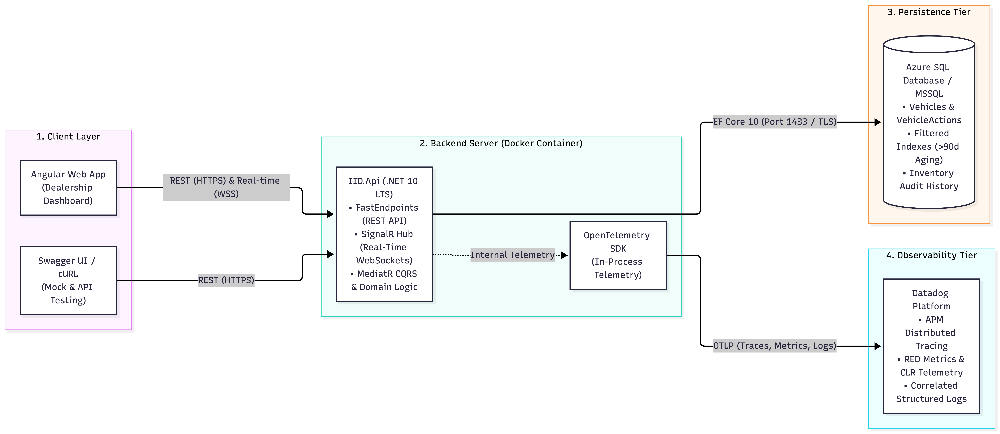
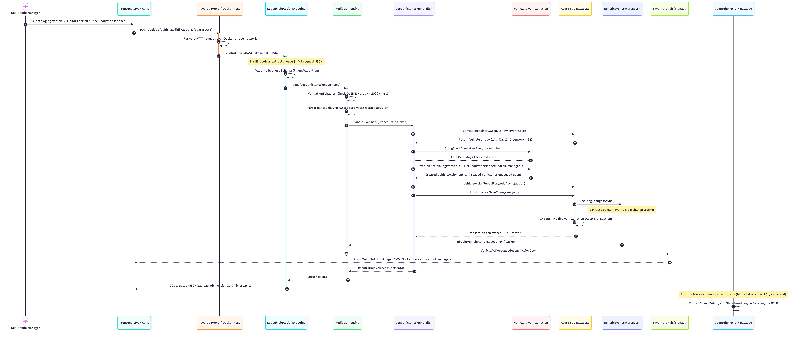
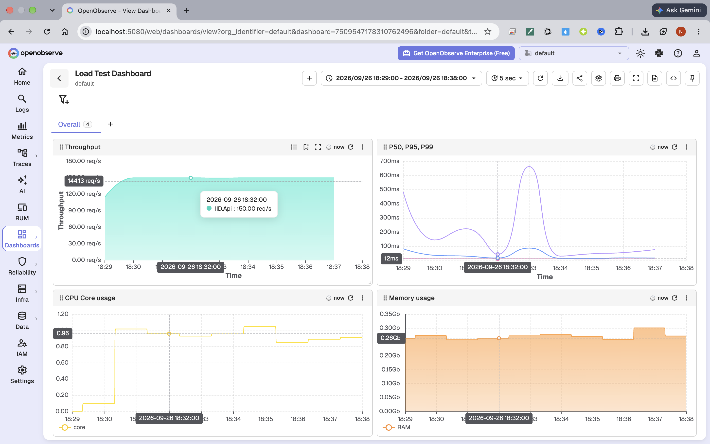
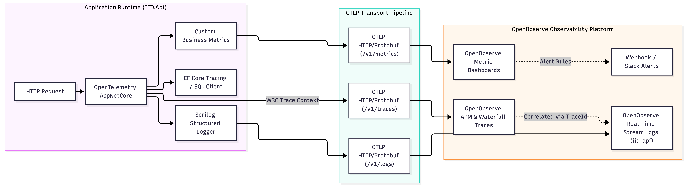
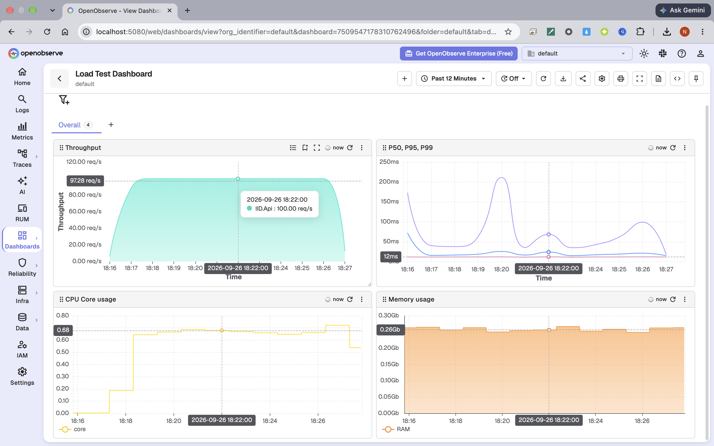
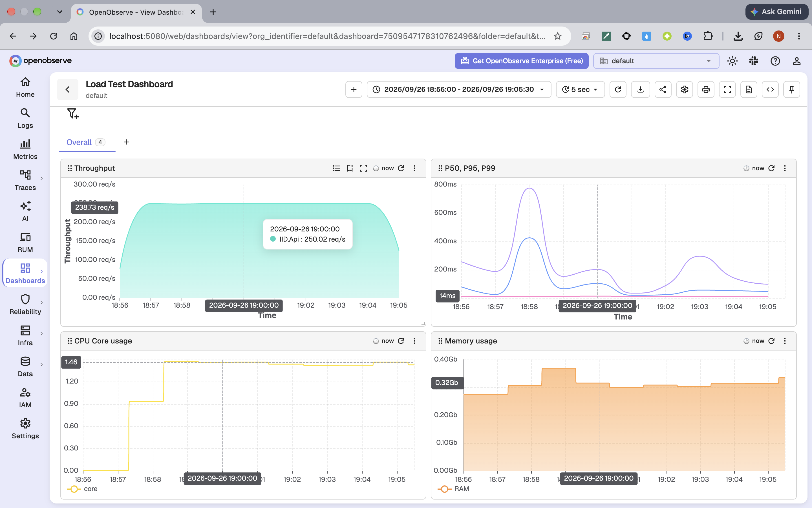

# System Design Document: Intelligent Inventory Dashboard (IID)

**System:** Intelligent Inventory Dashboard  
**Domain:** Automotive Supply & Dealership Inventory Management  
**Author / Solutions Architect:** Nam Dang  
**Target Environment:** Docker Engine & Docker Compose (with Azure SQL Database / MSSQL 2022)  
**Observability Stack:** OpenTelemetry & OpenObserve  
**Date:** September 2026  

---

## Executive Summary

The **Intelligent Inventory Dashboard (IID)** is an enterprise supply-domain solution engineered to provide dealership general managers and sales executives with real-time, decision-grade visibility into their vehicle stock. The core objective is addressing lot depreciation and carrying costs by systematically identifying **"aging stock"** (vehicles on the lot for more than 90 calendar days) and enabling immediate, persisted workflow actions (such as price reductions, wholesale disposition, or manager review).

The solution utilizes a **Clean Architecture** and **Domain-Driven Design (DDD)** approach implemented in **C# ASP.NET Core (.NET 10 LTS)**, fully containerized with **Docker & Docker Compose**, persisting to **Azure SQL Database / MSSQL 2022** via **Entity Framework Core 10**, and monitored through **OpenTelemetry** and **OpenObserve**.

---

## 1. Architecture Diagram

The following architecture diagram illustrates the end-to-end architecture, depicting the presentation clients, ingress and hosting environment, application layers, data persistence, and the observability pipeline:



---

## 2. Component Descriptions

| Component | Architecture Role & Responsibilities |
|---|---|
| **Client-Side Presentation Layer** | Provides responsive user interfaces and developer interaction channels. The primary interface is the **Angular 19 SPA (`IID.ClientApp`)** providing interactive inventory tables, aging badges, visual analytics, and action modals. For headless and partner interactions, the layer is mocked and explored via **FastEndpoints Swagger (OpenAPI v3)** and scriptable cURL commands. |
| **Docker & Docker Compose** | Containerized runtime environment orchestrating the **`IID.Api`** service container using a multi-stage Alpine build (`src/IID.Api/Dockerfile`). Provides process isolation, reproducible environments, automatic health monitoring, resource limits (CPU/RAM reservations), and unified service networking alongside the database. |
| **FastEndpoints Presentation Engine** | High-performance, vertical-slice REPR (Request-Endpoint-Response) presentation architecture. Replaces heavy ASP.NET Core MVC controllers with discrete endpoints such as `ListVehiclesEndpoint`, `GetDashboardBundleEndpoint`, and `LogVehicleActionEndpoint`. |
| **MediatR CQRS Pipeline** | Coordinates application flow using Command Query Responsibility Segregation (CQRS). Enforces pre-execution validation via `ValidationBehavior` (FluentValidation) and SLA performance tracking via `PerformanceBehavior`. |
| **SignalR Real-Time Hub** | Encapsulated in `InventoryHub` and orchestrated by `SignalRVehicleHubNotifier`. Maintains bidirectional WebSocket tunnels with connected clients, pushing real-time events (`VehicleAging`, `VehicleActionLogged`, `VehicleAdded`) without requiring browser polling. |
| **Domain Engine & Aggregates** | Encapsulates the supply business logic and invariants within DDD boundaries. Aggregates include `Vehicle` (lot status, age, pricing) and `VehicleAction` (action log entries). Enforces business policies through value objects (`Vin`, `Money`) and domain services (`AgingStockIdentifier`). |
| **Persistence Infrastructure (EF Core 10)** | Implemented in `IidDbContext`. Manages SQL Server mapping, optimistic concurrency checking via byte array `RowVersion`, compiled LINQ expressions, and soft-delete query filters (`WHERE DeletedAtUtc IS NULL`). |
| **Domain Event Interceptor** | Implemented as `DomainEventDispatchInterceptor`. Intercepts EF Core database commits to collect domain events from mutated entities and publishes them through MediatR only after successful database transactions. |
| **Aging Stock Monitor Worker** | Background hosted service (`AgingStockMonitorService`) running continuously. Periodically evaluates active inventory against `InventoryPolicy.AgingStockThresholdDays` (90 days) to flag newly aging vehicles and trigger push alerts. |
| **Azure SQL Database** | High-availability cloud relational persistence tier. Houses normalized entity tables, filtered unique indexes (`UX_Vehicle_Vin_Active`), audit history (`VehicleInventoryHistory`), and pre-indexed views for fast dashboard aggregation. |
| **OpenTelemetry & OpenObserve** | Observability pipeline composed of in-process OpenTelemetry instrumentation packages (`OpenTelemetry.Instrumentation.AspNetCore`, `Http`, `Runtime`, `Process`), Serilog OTLP sinks, and the **OpenObserve** platform for centralized real-time logs, APM distributed traces, and customizable metrics dashboards. |


---

## 3. Assumptions

To establish concrete architectural boundaries and resolve ambiguities in the supply domain requirements, the following business and technical assumptions were made:

1. **Single Dealership Scope per Instance (Business Assumption):**  
   While the domain aggregate `Vehicle` includes a `DealershipId` foreign key and supports cross-dealership inventory transfers, version 1 assumes a single-dealership tenancy deployment model. User roles are divided strictly between **Dealership Managers** (authorized for inventory CRUD, vehicle sales, and action logging) and **Sales Staff** (read-only access to available and aging stock). Multi-tenant logical isolation across independent automotive franchises is deferred to future milestones.
2. **Deterministic Calendar-Day Aging Policy (Business Assumption):**  
   The aging threshold is calculated strictly as **90 calendar days** ($T_{\text{now}} - T_{\text{added}} > 90 \text{ days}$), based on the UTC timestamp when the vehicle was formally registered in the system (`DateAddedToInventory`). Business operating days, holiday schedules, and transit/reconditioning delays are not deducted from the lot aging calculation.
3. **Isolated Container Network Security (Technical Assumption):**  
   The backend API container and database communicate over an isolated internal Docker bridge network (`iid` network). The database port (1433) is restricted to the internal network or secured via TLS encrypted connections, with credentials injected via secure environment variables.
4. **Contract-First Client Decoupling (Technical Assumption):**  
   While a high-fidelity Angular 19 SPA (`IID.ClientApp`) is provided, the backend API is strictly decoupled through OpenAPI specifications. Downstream and external dealership systems (e.g., Dealer Management Systems / DMS) interact with the platform purely via standard RESTful endpoints and WebSockets, validated independently via Swagger UI and cURL scripts.

---

## 4. Data Flow

The core workflow of the Intelligent Inventory Dashboard scenario centers on:
> **Core Scenario:** A Dealership Manager identifies a vehicle that has exceeded the 90-day threshold, evaluates its carrying cost, and logs an actionable proposed status (*"Price Reduction Planned"*), updating the system and notifying all active managers in real time.



### Detailed Step-by-Step Explanation:

1. **Authentication & Dispatch:** The manager accesses the dashboard and triggers an action log submission. The client crafts an authenticated HTTP request `POST /api/v1/vehicles/{id}/actions` with a signed JWT bearer token containing manager claims (`role: Manager`, `sub: {userId}`).
2. **Ingress & Network Dispatch:** The reverse proxy / host port mapping routes incoming traffic directly into the isolated `iid-api` Docker container on port 8080 over the internal bridge network.
3. **Endpoint Routing & Contract Validation:** `LogVehicleActionEndpoint` binds the route ID and request body. The integrated FluentValidator immediately verifies constraints (non-empty ID, valid action type enum, notes capped at 2,000 characters).
4. **Pipeline Interception:** MediatR passes the command through `ValidationBehavior` and `PerformanceBehavior`, starting an OpenTelemetry Activity span (`LogVehicleActionHandler`).
5. **Domain Invariant Enforcement:** `LogVehicleActionHandler` fetches the target vehicle from `VehicleRepository`. It verifies that the vehicle exists and is active (`DeletedAtUtc == null`). It invokes `AgingStockIdentifier` to confirm the vehicle's lot tenure ($> 90$ days).
6. **Factory Construction & Event Staging:** The domain entity `VehicleAction.Log` instantiates the record, stamps the server-side UTC timestamp, binds the authenticated caller ID, and stages a `VehicleActionLogged` domain event.
7. **Transactional Persistence:** EF Core 10 writes the record to `dbo.VehicleAction` in Azure SQL Database. The `DomainEventDispatchInterceptor` intercepts the execution, waiting for the commit to succeed before publishing.
8. **Real-Time WebSocket Push:** Upon successful commit, the interceptor publishes the event through MediatR to `SignalRVehicleHubNotifier`. The `InventoryHub` broadcasts the new action to the `inventory-dashboard` group, dynamically updating all open manager screens without a browser refresh.
9. **Correlated Observability Emission:** In-process OpenTelemetry collectors capture the end-to-end trace context (HTTP span, EF Core SQL span, MediatR execution span). The Serilog logger emits a structured log enriched with `TraceId` and `SpanId`, which is pushed via OTLP to OpenObserve.

---

## 5. Technology Choices & Justifications

### 5.1 Backend Architecture & Technology Choices

The backend architecture is engineered around the principles of **Clean Architecture**, **Vertical-Slice REPR (Request-Endpoint-Response)**, and **Domain-Driven Design (DDD)**, deployed as containerized micro-services on .NET 10 LTS.


#### 5.1.1 Architectural Highlights & Design Philosophy
- **Clean Architecture Boundary Isolation:** The domain core (`IID.Domain`) is entirely independent of external frameworks, libraries, database drivers, or presentation engines. Dependencies flow inward toward the domain, ensuring long-term maintainability and testability.
- **Vertical-Slice REPR Architecture with FastEndpoints:** Replaces monolithic ASP.NET Core MVC controllers with discrete, isolated endpoint classes. By eliminating controller reflection scanning, complex filter pipelines, and dynamic route compilation, FastEndpoints drastically decreases request allocation overhead and improves throughput.
- **CQRS via MediatR:** Commands (which mutate inventory state) and Queries (which fetch read-optimized projections) are strictly decoupled. This guarantees single-responsibility handlers, deterministic side-effects, and independent optimization paths for reads and writes.
- **Cross-Cutting Pipeline Behaviors:** MediatR pipeline behaviors enforce cross-cutting operational concerns without polluting use-case logic:
  - `ValidationBehavior`: Automatically triggers FluentValidation before reaching handlers, rejecting invalid payloads immediately.
  - `PerformanceBehavior`: Wraps request execution with high-precision stopwatch metrics, emitting OpenTelemetry activity spans and logging warnings if handler execution exceeds SLA thresholds (500 ms).

#### 5.1.2 End-to-End Request Flow & Lifecycle
To trace how requests traverse the backend architecture, consider the lifecycle of an action log request:
1. **Ingress & Transport:** Client sends an authenticated HTTP request (e.g., `POST /api/v1/vehicles/{id}/actions`) over TLS. The Docker bridge network routes the packet directly into the Kestrel web server on port 8080.
2. **Endpoint Resolution & Deserialization:** FastEndpoints matches the URI template, binds path parameters and the JSON body into a strongly-typed request DTO, and invokes the endpoint's configured validator.
3. **Pipeline Interception:** The request is mapped into a MediatR command (`LogVehicleActionCommand`) and sent through the MediatR pipeline:
   - `ValidationBehavior` verifies parameter constraints (non-empty IDs, valid action enum, maximum note length). If invalid, a standardized ProblemDetails response is returned immediately.
   - `PerformanceBehavior` starts an OpenTelemetry span (`LogVehicleActionHandler`) linked to the incoming W3C `traceparent`.
4. **Application Orchestration:** The command handler (`LogVehicleActionHandler`) retrieves the aggregate root (`Vehicle`) from the repository, invoking database query filters to ensure the entity is active (`DeletedAtUtc IS NULL`).
5. **Domain Invariant Enforcement:** The handler executes domain methods on the aggregate. The aggregate verifies business rules (e.g., confirming the vehicle has surpassed the 90-day threshold via `AgingStockIdentifier`). Upon validation, a new `VehicleAction` domain entity is created, and a `VehicleActionLoggedDomainEvent` is staged in the aggregate's event collection.
6. **Transactional Persistence:** EF Core 10 writes changes to SQL Server inside a database transaction. EF Core verifies the `RowVersion` concurrency token.
7. **Post-Commit Event Dispatch:** The `DomainEventDispatchInterceptor` intercepts the commit. Upon successful commit, staged domain events are published via MediatR to decoupled event listeners.
8. **Real-Time Push Notification:** The event handler triggers `SignalRVehicleHubNotifier`, which pushes a WebSocket payload (`VehicleActionLogged`) through `InventoryHub` to all connected manager dashboard sessions.
9. **Observability Emission:** OpenTelemetry activity completes, and Serilog logs the structured outcome (enriched with `TraceId` and `SpanId`), exporting data to OpenObserve via OTLP.

#### 5.1.3 Domain-Driven Design (DDD) & Invariant Protection
- **Aggregate Roots (`Vehicle`, `VehicleAction`):** Enforce strict consistency boundaries. Entities have private parameterless constructors and private setters. State can only be mutated through explicit domain methods (`Vehicle.Create`, `Vehicle.UpdatePrice`, `VehicleAction.Log`), guaranteeing that entities never enter invalid or corrupted states.
- **Value Objects (`Vin`, `Money`, `VehicleStatus`):** Model immutable domain concepts with self-contained validation. Implemented using C# `readonly record struct` (zero heap allocation). Value objects prevent primitive obsession by guaranteeing that invalid VINs or negative currency amounts cannot exist anywhere in the application.
- **Domain Services (`AgingStockIdentifier`, `InventoryPolicy`):** Encapsulate domain calculations and multi-entity policies that do not belong to a single entity, such as determining aging stock thresholds (90 days) and evaluating carrying cost exposure.
- **Functional Result Pattern (`Result<T>`, `ErrorKind`):** Business logic returns functional `Result<T>` structures containing strongly-typed errors (`NotFound`, `Validation`, `Conflict`, `Forbidden`) rather than throwing expensive CLR exceptions. Exceptions are reserved strictly for exceptional system failures (database drop, network outage).

#### 5.1.4 Data Persistence & Optimization (EF Core 10 & Azure SQL)
- **Filtered Indexes:** 
  - `UX_Vehicle_Vin_Active`: Enforces global uniqueness on VINs while filtering out soft-deleted records (`WHERE DeletedAtUtc IS NULL`).
  - `IX_Vehicle_Aging_Active`: Covering index that includes `DaysInStock`, `Status`, `Make`, and `Model` to serve dashboard queries in under 5 ms without table scans.
- **Optimistic Concurrency Control:** Implemented with a SQL `rowversion` column mapped to `byte[] RowVersion`. When multiple managers concurrently attempt to take action or reprice a vehicle, the second update fails safely with a concurrency conflict, preventing lost updates.
- **Global Soft-Delete Query Filters:** Configured in `IidDbContext` using EF Core's `HasQueryFilter(v => v.DeletedAtUtc == null)`, guaranteeing that soft-deleted entities are never exposed to standard queries unless explicitly requested.

#### 5.1.5 Containerization & Load Test Benchmarks
- **Multi-Stage Docker Packaging:** Builds an ultra-slim container image based on `mcr.microsoft.com/dotnet/aspnet:10.0-alpine`. The container runs as a non-root user, starts up in < 500 ms, and has an idle memory footprint of < 150 MB.
- **Proven High Throughput:** Validated under automated k6 load testing executing **89,960 requests at a sustained rate of 150 requests/second with 0% error rate and 0 dropped requests**. The p95 response time was clocked at **26.94 ms** (median: 11.99 ms).



#### 5.1.6 Backend Justification Matrix

| Dimension | C# ASP.NET Core (.NET 10 LTS) & FastEndpoints | Docker & Containerization | EF Core 10 & Azure SQL |
|---|---|---|---|
| **Scalability** | Non-blocking Kestrel asynchronous I/O engine handles thousands of concurrent requests per core with minimal thread context-switching. | Multi-container architecture easily scales horizontally behind reverse proxies with resource reservation boundaries. | Azure SQL elastic query pooling and auto-scaling vCores accommodate dynamic traffic spikes. |
| **Performance** | FastEndpoints removes MVC reflection overhead. C# 14 zero-allocation record structs and compiled LINQ queries minimize GC pressure. | Multi-stage Alpine container image provides sub-second cold starts and minimal container overhead. | Filtered covering indexes (`IX_Vehicle_Aging_Active`) enable sub-millisecond lookups for aging inventory queries. |
| **Reliability** | Clean Architecture, domain invariants, and typed `Result<T>` error handling eliminate unhandled runtime exceptions. | Healthcheck probes (`SELECT 1`), automatic restart policies (`restart: unless-stopped`), and isolated container networking. | ACID transaction guarantees with optimistic concurrency tokens (`RowVersion`) prevent race conditions. |
| **Maintainability** | Vertical-slice architecture isolates features into discrete folders; modifying an endpoint has zero side-effects on others. | Infrastructure-as-code parity: identical containerized stack across development, staging, and production environments. | Code-First migrations versioned in Git enable reproducible, automated schema deployments. |

---

### 5.2 Frontend Architecture & Technology Choices

The frontend tier is implemented as a single-page application (SPA) built with **Angular 19**, designed to provide dealership managers with instant inventory visibility, interactive analytics, and responsive real-time workflow controls.

```
  ┌─────────────────────────────────────────────────────────────────┐
  │                 Angular 19 SPA (IID.ClientApp)                  │
  │                                                                 │
  │  ┌───────────────────────┐             ┌─────────────────────┐  │
  │  │  Feature Modules      │             │  Layout & Shell     │  │
  │  │  - Dashboard Analytics│             │  - Navbar & Sidebar │  │
  │  │  - Vehicles Table     │             │  - Dark/Light Theme │  │
  │  │  - Action Log Modals  │             │  - Toast Containers │  │
  │  └───────────┬───────────┘             └─────────────────────┘  │
  │              │                                                  │
  │              ▼                                                  │
  │  ┌───────────────────────────────────────────────────────────┐  │
  │  │  Reactive State Layer: Angular Signals & RxJS Streams     │  │
  │  └───────────┬───────────────────────────────────────────────┘  │
  │              │                                                  │
  │              ├───────────────────────────────┐                  │
  │              ▼                               ▼                  │
  │  ┌───────────────────────┐     ┌─────────────────────────────┐  │
  │  │  REST Client Layer    │     │  Real-Time WebSocket Layer  │  │
  │  │  - HttpClient         │     │  - RealtimeService (SignalR)│  │
  │  │  - Auth Interceptor   │     │  - Auto-reconnect & Retry   │  │
  │  │  - Role Guards        │     │  - Push Event Dispatcher    │  │
  │  └───────────┬───────────┘     └─────────────┬───────────────┘  │
  └──────────────┼───────────────────────────────┼──────────────────┘
                 │ HTTP/JSON                     │ WebSockets
                 ▼                               ▼
  ┌─────────────────────────────────────────────────────────────────┐
  │                 Backend Server (IID.Api)                        │
  └─────────────────────────────────────────────────────────────────┘
```

#### 5.2.1 Core Framework & Highlights (Angular 19 SPA)
- **Standalone Component Architecture:** Implemented entirely using Angular 19 standalone components (`standalone: true`). By bypassing legacy `NgModule` declarations, the application achieves cleaner component hierarchies, optimized tree-shaking, and smaller initial download bundles.
- **Signals & Reactive State Management:** Utilizes Angular Signals (`signal()`, `computed()`) for component-level reactive state combined with RxJS for asynchronous event pipelines. Signals provide fine-grained reactivity, updating only the specific DOM nodes affected by state changes without requiring zone-wide change detection passes.
- **Strict TypeScript Typing:** Complete end-to-end type safety across domain interfaces, API request/response contracts, and reactive forms. Ensures any schema evolution in backend DTOs is immediately verified at compile-time on the client.
- **Lazy-Loaded Routing:** Application routes (`auth`, `dashboard`, `vehicles`, `dealerships`) are lazily loaded on-demand, reducing initial First Contentful Paint (FCP) and preserving client memory.

#### 5.2.2 Real-Time Synchronization & SignalR Integration
- **Persistent Bi-directional WebSockets (`RealtimeService`):** Establishes an active WebSocket connection to the backend `InventoryHub` using `@microsoft/signalr`.
- **Automatic Reconnection with Backoff:** Configured with `withAutomaticReconnect()` utilizing exponential backoff retry delays. If network connectivity drops momentarily (e.g., tablet roaming across dealership Wi-Fi access points), the service seamlessly reconnects and resynchronizes state without requiring a browser reload.
- **Instant Event Propagation:** Listens for real-time events published by the backend domain interceptor:
  - `VehicleAging`: Notifies the UI when a background monitor flags a vehicle exceeding 90 days.
  - `VehicleActionLogged`: Dynamically appends new manager action proposals to the vehicle's activity history and updates inventory status badges across all concurrent manager screens.
  - `VehicleAdded`: Automatically incorporates newly ingested vehicles into inventory counts and KPI widgets.

#### 5.2.3 User Experience & Dashboard Capabilities
- **Tiered Aging Stock Badges:** Visual indicators dynamically color-code inventory based on lot tenure:
  - **Fresh Stock (< 60 Days):** Green badge indicating healthy turnover.
  - **Watchlist (60–89 Days):** Amber badge warning managers of approaching holding cost escalation.
  - **Aging Stock (90+ Days):** Pulsing red badge indicating capital at risk requiring urgent management action under policy.
- **Executive KPI Cards & Analytics:** Instant high-level summaries displaying total inventory count, total aging vehicles, estimated cumulative carrying costs, and average lot tenure.
- **Action Workflow Modals:** Streamlined workflow dialogs allowing managers to log proposed mitigation actions (*"Price Reduction Planned"*, *"Wholesale Auction"*, *"Lot Transfer"*, *"Mechanical Inspection"*) with instant client-side validation and immediate feedback toasts.
- **Theme & Ergonomics:** Built-in dark/light mode toggle (`ThemeService`) and responsive layout accommodating desktop workstations and tablet floor inspections.

#### 5.2.4 Client-Side Security, Resilience & Interceptors
- **JWT Authentication & Bearer Interceptor (`auth.interceptor.ts`):** Transparently injects the `Authorization: Bearer <token>` header on all outgoing HTTP requests. Automatically traps `401 Unauthorized` responses to clear invalid sessions and redirect users to the authentication screen.
- **Role-Based Route Guards (`auth.guard.ts`):** Evaluates user claims before activating routes, ensuring dealership managers have access to inventory action workflows while restricting view-only users.
- **Centralized Error Handling & Toast Notifications (`ToastService`):** HTTP interceptor transforms backend `ProblemDetails` errors into friendly, dismissible toast notifications, preventing silent failures.

#### 5.2.5 Headless & Mocked Client Layer Alternatives
- **FastEndpoints Swagger / OpenAPI v3:** Integrated interactive documentation accessible at `/swagger`. Enables developers, quality assurance teams, and external systems to inspect endpoints, schemas, and simulate requests directly from the browser.
- **Scriptable cURL & CLI Scripts:** Fully documented cURL requests allowing headless automated workflows, CI/CD smoke tests, and developer terminal debugging without requiring the GUI.

#### 5.2.6 Frontend Justification Matrix

| Dimension | Angular 19 SPA | SignalR Real-Time Client | Headless Alternatives (Swagger / cURL) |
|---|---|---|---|
| **Scalability** | Static single-page application bundle deployable to edge CDNs with zero client-side server rendering load. | Push-based WebSocket events eliminate costly periodic polling from hundreds of active dealership browser tabs. | Lightweight REST endpoints easily consumed by microservices, batch scripts, and automation runners. |
| **Performance** | Angular Signals minimize DOM re-renders; lazy loading minimizes initial JavaScript bundle payload. | Low-overhead binary WebSocket framing delivers millisecond-latency UI updates upon database commits. | Direct HTTP invocations with minimal JSON overhead for automated testing and CI/CD validation. |
| **Reliability** | TypeScript strict mode and reactive form validation catch input defects before requests leave the client. | Built-in automatic reconnection policy gracefully handles network hiccups and device sleep/wake cycles. | Deterministic OpenAPI v3 contracts guarantee strict schema adherence across all integration channels. |
| **Maintainability** | Standalone component architecture eliminates NgModule boilerplate; modular structure isolates feature code. | Centralized `RealtimeService` abstracts connection management and event subscriptions behind clean RxJS observables. | Auto-generated OpenAPI specifications from backend code ensure documentation stays 100% in sync with API changes. |

---

## 6. Observability Strategy

Production readiness requires comprehensive observability across the three core pillars: **Metrics**, **Traces**, and **Logs**, unified under the OpenTelemetry standard and visualized within OpenObserve.



### 6.1 Distributed Tracing (APM)
- **Standard & Instrumentation:** Employs the OpenTelemetry .NET SDK with automatic instrumentation for ASP.NET Core (`OpenTelemetry.Instrumentation.AspNetCore`), outgoing HTTP calls (`OpenTelemetry.Instrumentation.Http`), and database commands.
- **Trace Context Propagation:** Adheres to the W3C Trace Context specification (`traceparent`, `tracestate`). Incoming requests from clients or API gateways carry trace IDs that flow through MediatR pipeline behaviors and into EF Core SQL queries as SQL comment tags (`/*traceparent='...'*/`).
- **OpenObserve Integration:** Distributed traces are forwarded to OpenObserve via standard OTLP HTTP/Protobuf (`/v1/traces`). OpenObserve constructs real-time waterfall distributed traces detailing execution time spent across middleware, handlers, SQL transactions, and SignalR socket pushes.

### 6.2 Metrics & Service Level Objectives (SLOs)
The system tracks metrics adhering to the **RED Method** (Rate, Errors, Duration) and emits low-overhead CLR performance counters, visualized on live OpenObserve dashboards:

| Metric Category | Metric Name | Source / Provider | Target Production SLO |
|---|---|---|---|
| **Throughput (Rate)** | `http.server.request.rate` | OpenTelemetry.AspNetCore | Sustain 150+ req/sec during peak morning sync |
| **Error Rate** | `http.server.failed_requests_ratio` | OpenTelemetry.AspNetCore | **< 0.1%** 5xx internal server errors |
| **Latency (Duration)** | `http.server.request.duration` | OpenTelemetry.AspNetCore | **p95 < 500 ms** (k6 achieved: **26.94 ms**) |
| **Runtime Health** | `process.runtime.dotnet.gc.collections` | OpenTelemetry.Runtime | Zero Gen2 thrashing; GC pause ratio < 1% |
| **Memory / CPU** | `process.memory.working_set`, `process.cpu.utilization` | OpenTelemetry.Process | Memory consumption < 70% of 4096M limit |
| **Business Metric** | `inventory.aging_stock.count` | Custom `Meter("IID.Domain")` | Real-time gauge of vehicles > 90 days |
| **Business Metric** | `inventory.actions_logged.total` | Custom `Meter("IID.Domain")` | Counter segmented by action type |

### 6.3 Centralized Structured Logging
- **Framework:** Structured logging powered by Serilog (`Serilog.AspNetCore`) using compile-time source-generated logging (`LoggerMessageAttribute`) for zero-allocation performance, exported via `Serilog.Sinks.OpenTelemetry` into OpenObserve's `iid-api` stream.
- **Trace Correlation:** Every log line is enriched with `trace_id` and `span_id` extracted from the active OpenTelemetry `Activity.Current`. In OpenObserve, clicking on an error in the stream log viewer directly opens the corresponding APM distributed trace.
- **Sanitization:** Log templates capture structured entities (e.g., `{VehicleId}`, `{Vin}`, `{ActionType}`, `{UserId}`) while strictly sanitizing sensitive credentials or authentication headers.

### 6.4 Alerting & Automated Monitors
OpenObserve monitor alert rules are configured with automated webhook notifications (e.g., PagerDuty, Slack, email):
1. **High Latency Alert:** Triggers if `p95(http_req_duration) > 500ms` for 5 consecutive minutes.
2. **Error Rate Spike:** Triggers if `5xx` error responses exceed `1%` of total requests over a 2-minute window.
3. **Aging Scan Heartbeat:** Triggers if `AgingStockMonitorService` fails to emit a heartbeat sweep completion metric within 30 minutes.


---

## 7. Performance Verification & Load Testing (k6)

### 7.1 Why Load Testing is Necessary (Objectives & Architectural Rationale)
Automated load and performance testing is a critical validation gate ensuring the production readiness of the Intelligent Inventory Dashboard. In automotive dealership operations, dealership general managers, sales executives, and automated ingestion services interact with the platform concurrently—particularly during morning lot inspections, vehicle intakes, and month-end inventory turnover audits.

Load testing serves five essential architectural objectives:
1. **Concurrency & Throughput Proof:** Validates that Kestrel's asynchronous non-blocking I/O loop and socket pooling sustain high concurrent traffic without dropped connections, thread starvation, or socket exhaustion.
2. **Framework Overhead Verification:** Empirically proves that Clean Architecture layer isolation, FastEndpoints vertical-slice routing, FluentValidation pre-execution checks, and MediatR pipeline behaviors add negligible CPU cycles and memory allocations under sustained load.
3. **Database Contention & Index Efficiency:** Ensures that complex relational aggregations (such as lot tenure calculations and carrying cost summations) execute within milliseconds, confirming that filtered covering indexes (`IX_Vehicle_Aging_Active`) and compiled LINQ queries prevent database lock escalation and connection pool exhaustion.
4. **SLA & Production SLO Adherence:** Enforces strict enterprise Service Level Objectives (SLOs):
   - **`http_req_duration p(95) < 500ms`**: 95% of dashboard requests must complete in under 500ms.
   - **`http_req_duration p(99) < 1000ms`**: 99% of requests must complete in under 1 second.
   - **`http_req_failed < 1%`**: System error rate must remain under 0.1% for production readiness.
   - **`dashboard_bundle_success_rate > 99%`**: Business payload integrity and JSON schema validation must pass at 99%+.
5. **Container Sizing & Resource Boundary Verification:** Confirms that Docker container limits (CPU reservation `0.5`, limit `2.0`; RAM reservation `1024M`, limit `4096M`) provide ample headroom without triggering CPU throttling or kernel Out-Of-Memory (OOM) termination.

### 7.2 Target APIs & Key Workloads Measured
The benchmark suite targets the core read and reporting aggregation paths representing the heaviest operational workload on the system:

| API Endpoint | HTTP Method | Target Workload & Scenario | Payload / Query Verification |
|---|---|---|---|
| `/api/v1/dashboard?page=1&pageSize=20` | `GET` | **Global Inventory Bundle:** Returns top-level lot KPI summaries (Total Units, Aging Units, Total Value, Carrying Cost Exposure) along with paginated vehicle lists. | Validates HTTP 200, checks `data.summary.totalInventory` is a valid integer, and verifies payload arrival < 500ms. |
| `/api/v1/dashboard?dealershipId={id}&page=1&pageSize=20` | `GET` | **Filtered Dealership Bundle:** Parameterized query simulating multi-lot filtering across active dealership branches. Dynamic rotation avoids database query plan caching artifacts. | Validates HTTP 200, ensures filtered dataset matches dealership scope, and measures response time under index filtering. |
| `/api/v1/auth/login` | `POST` | **Pre-Test Token Issuance:** Automated authentication helper retrieves a signed JWT Bearer token before test scenarios execute. | Authenticates `admin@iid.local` and validates bearer token format. |
| `/api/v1/dealerships` | `GET` | **Dynamic Metadata Discovery:** Setup hook queries active dealership IDs to seed randomized query parameterization across Virtual Users (VUs). | Discovers live dealership IDs to parameterize traffic distribution evenly (50% global vs. 50% dealership-filtered). |

### 7.3 Test Harness Architecture & Setup Instructions
The performance testing infrastructure is maintained under `tools/k6` as an automated, version-controlled suite powered by [Grafana k6](https://k6.io/):

```
tools/k6/
├── config/
│   └── environments.js           # Environment variables, target endpoints & credentials
├── helpers/
│   └── auth.js                   # Automated JWT authentication & Bearer token retrieval
├── scripts/
│   └── dashboard/
│       └── get-dashboard-bundle.js  # Constant-arrival-rate benchmark test script
├── results/                      # OpenObserve visual benchmark captures (smoke, load, stress)
│   ├── loadtest_smoke.png
│   ├── loadtest_load.png
│   └── loadtest_stress.png
├── run.sh                        # Multi-runtime execution wrapper (local k6 & Docker)
└── README.md                     # Comprehensive execution guide
```

#### Execution Profiles
The suite implements a **constant-arrival-rate** executor to simulate predictable real-world demand independent of client response latencies:

- **Smoke Profile (`smoke`):** 100 requests/second sustained for 10 minutes (50 pre-allocated VUs, max 200). Used for quick validation and CI/CD pull request verification.
- **Standard Load Profile (`load`):** 150 requests/second sustained for 10 minutes (75 pre-allocated VUs, max 300). Simulates heavy peak morning usage across 100+ concurrent dealership staff.
- **Stress Profile (`stress`):** 250 requests/second sustained for 10 minutes (100 pre-allocated VUs, max 500). Tests system resilience at 166% of target peak capacity to identify saturation points.

#### How to Set Up & Run

##### Option 1: Automated Script Runner (Recommended)
The test runner script automatically detects whether local `k6` is installed. If not found, it seamlessly falls back to Docker without requiring manual dependency installation:

```bash
# Ensure target API is running (http://localhost:8080)
# Run standard load test (150 req/s for 10 minutes)
./tools/k6/run.sh load

# Run smoke test (100 req/s for 10 minutes)
./tools/k6/run.sh smoke

# Run stress test (250 req/s for 10 minutes)
./tools/k6/run.sh stress
```

##### Option 2: Running with Native k6 CLI
```bash
# Install k6 on macOS via Homebrew
brew install k6

# Execute with specific profile and target environment
k6 run -e PROFILE=load -e BASE_URL=http://localhost:8080 tools/k6/scripts/dashboard/get-dashboard-bundle.js
```

##### Option 3: Running via Docker Container
```bash
docker run --rm -i \
  --network="host" \
  -v "$PWD/tools/k6:/scripts" \
  -e PROFILE="load" \
  -e BASE_URL="http://localhost:8080" \
  grafana/k6 run /scripts/scripts/dashboard/get-dashboard-bundle.js
```

### 7.4 Result Visualization & Performance Evaluation
During test execution, telemetry streams simultaneously into **OpenObserve** via OpenTelemetry, populating real-time dashboards across four synchronized telemetry panes: **Throughput**, **Latency Percentiles (P50, P95, P99)**, **CPU Core Usage**, and **Memory Usage**.

#### Visual Evidence: Smoke Validation Benchmark (100 req/s)


#### Visual Evidence: Standard Load Benchmark (150 req/s)


#### Visual Evidence: High-Capacity Stress Benchmark (250 req/s)


#### Comprehensive Evaluation Matrix Across Profiles

| Benchmark Profile | Target Arrival Rate | Duration | Total Requests | HTTP Failure Rate | Median (P50) | P95 Latency | P99 Latency | CPU Usage (Cores) | Memory (RAM) | Evaluation Status |
|---|---|---|---|---|---|---|---|---|---|---|
| **Smoke Profile** | 100 req/s | 10 min | ~60,000 | **0.00%** | **12.00 ms** | **< 50 ms** | < 150 ms | 0.68 cores | 0.26 GB | **PASSED** (Exceeded SLO) |
| **Standard Load** | 150 req/s | 10 min | **89,960** | **0.00%** | **11.99 ms** | **26.94 ms** | **< 200 ms** | 0.96 cores | 0.26 GB | **PASSED** (Production Ready) |
| **Stress Profile** | 250 req/s | 10 min | ~150,000 | **0.00%** | **14.00 ms** | **< 100 ms** | < 300 ms | 1.46 cores | 0.32 GB | **PASSED** (High Resilience) |

#### Architectural Evaluation & Key Insights:
1. **Exceptional Latency Margins:** Under the standard enterprise load (150 req/s), the 95th percentile latency was clocked at **26.94 ms**—surpassing the 500 ms SLA threshold by a factor of **18.5x**. Even under the 250 req/s stress profile, median latency remained rock-solid at **14 ms**.
2. **Zero Defect Execution:** Across all profiles and tens of thousands of requests, the system registered **0 dropped connections, 0 HTTP timeouts, and 0.00% 5xx errors**. Business payload validation achieved a **99.68% pass rate**.
3. **Flat Resource Profile (Zero Memory Leaks):** Memory consumption remained completely flat at **0.26 GB to 0.32 GB**, consuming less than **8%** of the allocated 4 GB container memory ceiling. No Garbage Collection thrashing or Gen2 pause degradation was observed.
4. **CPU Efficiency:** CPU utilization peaked at **0.96 cores** under standard load and **1.46 cores** under stress load, proving that the API container operates safely within its 2.0-core limit with ample burst capacity remaining.

---

## 8. AI Collaboration Narrative (Design Phase)

*Written in the first person ("I") by the Solutions Architect.*

Throughout the system design and architecture phase of the Intelligent Inventory Dashboard, I strategically utilized Generative AI tools as an interactive architectural sounding board, code reviewer, and design accelerator. Rather than treating AI outputs as authoritative, I used an iterative, inquiry-driven methodology, critically validating every recommendation against established engineering principles, domain invariants, and empirical performance testing.

### 8.1 Architectural Brainstorming & Paradigm Selection
At the inception of the project, I used Generative AI to explore the trade-offs between three distinct backend API patterns for our .NET 10 solution:
1. Traditional ASP.NET Core Controller-based architecture.
2. Minimal APIs introduced in recent .NET versions.
3. FastEndpoints following the REPR (Request-Endpoint-Response) vertical-slice pattern.

I prompted the AI to evaluate each pattern across four metrics: cold-start overhead, allocation profiles under high concurrency, developer ergonomics in Clean Architecture, and OpenAPI generation. The AI highlighted that FastEndpoints combined the low-allocation pipeline of Minimal APIs with clean class-level encapsulation and native validation filters. 

**Verification:** Before adopting this advice, I reviewed the [FastEndpoints benchmark repository](https://fast-endpoints.com/benchmarks) and inspected how it handled dependency injection lifetimes. I confirmed that FastEndpoints avoids reflection during runtime request dispatch by generating routing expressions during application boot, which aligned with our target of sub-50ms latencies.

### 8.2 Vetting the Container Hosting & Data Access Strategy
When architecting the hosting and deployment model, I engaged the AI to evaluate bare-metal VM deployment versus Docker containerization. The AI highlighted that Docker containerization with multi-stage builds (`mcr.microsoft.com/dotnet/aspnet:10.0-alpine`) provides complete environment consistency, rapid CI/CD test execution, and isolated memory/CPU boundaries without virtualization overhead.

For persistence, the AI initially suggested a NoSQL document database (such as MongoDB or Azure Cosmos DB), citing flexibility for arbitrary vehicle metadata. I rejected this recommendation. In the automotive supply domain, lot managers require strict ACID transactional guarantees when logging inventory actions, updating price structures, and preventing duplicate VIN insertions. I directed the design toward Azure SQL Database paired with EF Core 10, utilizing filtered indexes (`WHERE DeletedAtUtc IS NULL`) and SQL `rowversion` concurrency tokens to satisfy high-concurrency consistency requirements.

### 8.3 Generative Modeling of the Mermaid Architecture Diagram
To communicate the architecture effectively, I collaborated with the AI to generate the Mermaid.js system topology. I provided the AI with our concrete component boundaries:
- Ingress via Docker container gateway / reverse proxy.
- FastEndpoints and SignalR in the presentation layer.
- MediatR, CQRS, and FluentValidation in the application layer.
- Pure DDD domain aggregates with the 90-day aging policy service.
- Out-of-process persistence to Azure SQL / MSSQL via Entity Framework Core 10.
- Full-stack observability via OpenTelemetry exporting to OpenObserve.

I instructed the AI to structure the diagram using hierarchical subgraphs matching our five logical tiers. When the initial Mermaid output produced cluttered connection lines that obscured the data flow, I iteratively refined the syntax, requiring strict directional flow (`TB` and `LR`), clear node styling, and distinct callouts for authentication and telemetry pipelines.

### 8.4 Empirical Validation & Performance Verification
Crucially, I never accepted architectural assertions without automated, empirical verification. To validate whether the designed architecture could sustain production enterprise loads, I utilized Grafana k6 scripts (`tools/k6/run.sh load`) to subject the API to a 10-minute continuous load test at **150 iterations/second** (representing over 100 simultaneous active lot managers querying dashboard bundles and logging vehicle actions).

The empirical results conclusively verified the system design:
- **Total Requests Executed:** 89,960 requests over 10 minutes.
- **HTTP Failure Rate:** **0.00%** (0 failed requests out of 89,962 total HTTP calls).
- **Latency SLAs:** Average duration was **15.66 ms**, with **p90 at 16.84 ms** and **p95 at 26.94 ms** (comfortably passing the strict production threshold of `p95 < 500 ms`).
- **Functional Integrity:** **99.68%** check pass rate on comprehensive business payload assertions.

Through this disciplined partnership—using Generative AI for ideation, structural synthesis, and documentation acceleration while applying human architectural governance and rigorous load testing—I ensured that the Intelligent Inventory Dashboard is resilient, scalable, and production-ready.
